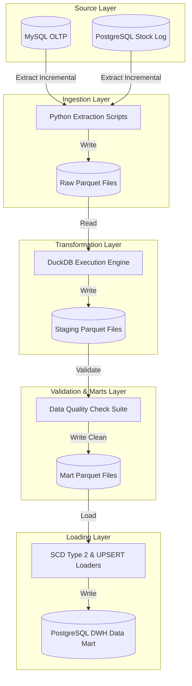
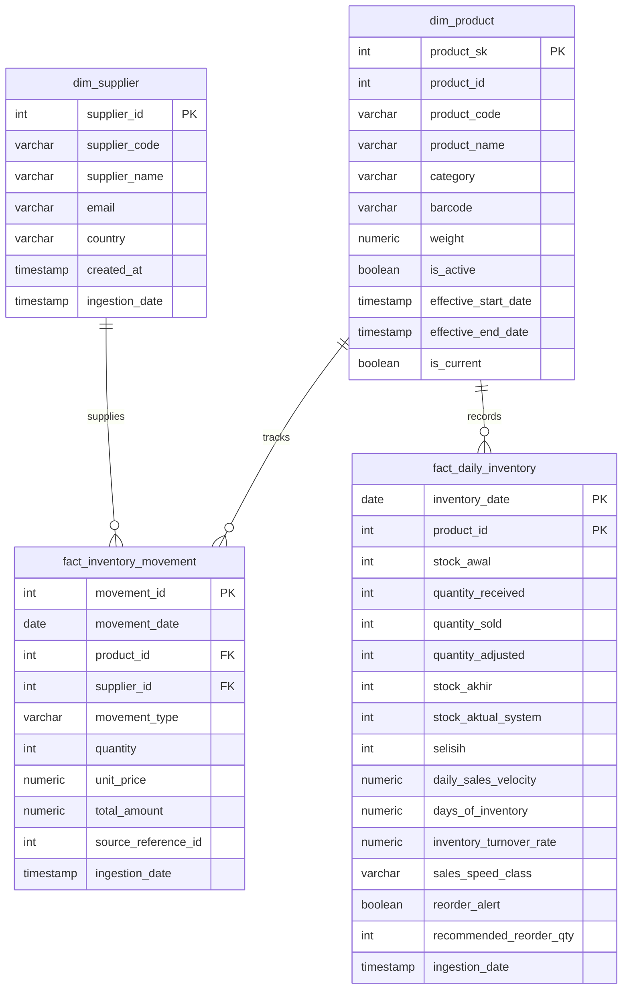

# Retail Inventory Analytics Pipeline

An end-to-end incremental data pipeline designed to ingest transactional retail datasets, transform them into analytical business metrics, enforce data quality gates, and load them into a dimensional Data Warehouse (DWH) implemented in PostgreSQL.

## 1. Project Overview

This project simulates the data platform for a retail business. The pipeline handles data extraction from OLTP databases, in-memory aggregation and transformation using DuckDB, data quality validation, and loading into a star-schema DWH. The load stage implements Slowly Changing Dimension (SCD) Type 2 logic for tracking product attributes and database-backed audit logging to maintain full pipeline observability.

## 2. Architecture

The architecture consists of a source transactional layer, a file-based staging storage layer, an in-memory transformation engine, and a Postgres-based OLAP Data Warehouse.



## 3. Technology Stack

*   **Language**: Python 3.10
*   **Query Engines**: SQL, DuckDB
*   **Data Serialization**: Apache Parquet, PyArrow
*   **Data Warehouse**: PostgreSQL
*   **Database Interfaces**: SQLAlchemy, Psycopg2, MySQL-Connector-Python
*   **Infrastructure**: Docker, Docker Compose
*   **Orchestration**: Apache Airflow
*   **Testing**: Pytest

## 4. Project Structure

```
retail-inventory-pipeline/
├── config/
│   ├── .env.example                   # Environment configuration template
│   ├── database.py                    # Database connection engines setup
│   └── configuration.py               # Project paths and configuration settings
├── data/
│   ├── raw/                           # Extracted raw files
│   ├── staging/                       # Intermediate transformation outputs
│   └── mart/                          # Validated datasets ready for loading
├── docker/
│   ├── db_init/
│   │   ├── 01_source_schema.sql      # MySQL OLTP schema definition
│   │   └── 02_target_schema.sql      # PostgreSQL DWH schema definition
│   └── Dockerfile                     # Worker application Dockerfile
├── orchestration/
│   └── inventory_pipeline_dag.py      # Airflow DAG definition
├── src/
│   ├── extract/
│   │   ├── extract_pipeline.py        # Extract phase orchestrator
│   │   ├── products.py                # Supplier and product extractors
│   │   ├── purchases.py               # PO and adjustment extractors
│   │   ├── sales.py                   # Sales transaction extractor
│   │   └── stock_daily.py             # Stock log extractor
│   ├── transform/
│   │   ├── transform_pipeline.py      # Transform phase orchestrator
│   │   ├── inventory_snapshot.py      # Daily snapshot aggregations
│   │   ├── inventory_turnover.py      # Days of inventory calculations
│   │   └── reorder_analysis.py        # Reorder metrics calculation
│   ├── quality/
│   │   ├── quality_pipeline.py        # DQ runner and compiler
│   │   ├── duplicate_check.py         # Composite key duplicate verification
│   │   ├── inventory_validation.py    # Retail business rules checks
│   │   └── null_check.py              # Null value verification
│   ├── marts/
│   │   ├── daily_inventory_snapshot.py # Daily inventory snapshot mart generator
│   │   ├── inventory_metrics.py       # Inventory movement mart generator
│   │   └── reorder_recommendation.py  # Reorder recommendation mart generator
│   ├── load/
│   │   ├── load_pipeline.py           # DWH load orchestrator
│   │   └── postgres_loader.py         # Incremental state, SCD 2, and upserts
│   ├── sql/
│   │   ├── inventory_snapshot.sql     # SQL template for daily inventory snapshot
│   │   ├── inventory_turnover.sql     # SQL template for turnover calculations
│   │   └── reorder_recommendation.sql # SQL template for reorder point metrics
│   ├── utils/
│   │   └── decorators.py              # Execution timing decorators
│   ├── mock_generator.py              # Seed data generation script
│   └── pipeline.py                    # Standalone CLI entrypoint
├── tests/
│   ├── test_inventory_snapshot.py     # Inventory math unit tests
│   ├── test_inventory_turnover.py     # Classification rule tests
│   ├── test_quality_checks.py         # Data quality pipeline integration tests
│   └── test_reorder_recommendation.py # Reorder recommendation tests
├── docker-compose.yml                 # Database service containers
├── requirements.txt                   # Project python dependencies
└── README.md
```

## 5. Data Pipeline Flow

*   **Extraction**: Connects to the source MySQL and PostgreSQL databases. It retrieves the last successfully run date from `inventory.etl_state` and incrementally queries transactions created or modified since that watermark. Results are saved as Parquet files in `data/raw/`.
*   **Transformation**: DuckDB processes the raw Parquet files locally in-memory. SQL templates calculate daily inventory snapshots, average sales velocity, inventory turnover rates, and reorder alerts. Cleaned staging parquets are generated in `data/staging/`.
*   **Data Quality Checks**: The staging datasets are verified using data quality rules: null checks on primary keys, duplicate checks on logical composite keys, and boundary validations (e.g. quantities cannot be negative). Failing critical checks halts the loading phase.
*   **Loading**: Verified datasets are upserted into the PostgreSQL target schema. The product catalog is processed using SCD Type 2 logic, updating validity flags and start/end dates. The runtime metadata, record counts, and pipeline execution status are committed to the `etl_audit` log table.

## 6. Data Model Overview

The PostgreSQL Data Warehouse implements a star schema optimized for analytical queries:



## 7. Key Features

*   **Incremental Loads via Watermarking**: Uses the `inventory.etl_state` table to track the high-watermark date of the last successful run, minimizing database CPU and memory load.
*   **Slowly Changing Dimension (SCD) Type 2**: Preserves history for product catalogs, tracking updates to fields (such as categories or weights) by closing out active records and inserting new ones.
*   **In-Memory Transformations**: Utilizes DuckDB to execute staging transformations directly on Parquet files, bypassing PostgreSQL transaction overhead for large analytical queries.
*   **Data Quality Gates**: Integrates NULL checks, duplicate key verification, and negative stock validations into the runtime flow.
*   **Observability & Audit Logging**: Captures pipeline run details (duration, status, extracted/loaded records, data quality exceptions) to `inventory.etl_audit` for performance analysis.

## 8. Local Setup

### Prerequisites

*   Docker and Docker Compose
*   Python 3.10+

### Setup Steps

1.  **Configure Environment Variables**:
    Create a local environment file from the template:
    ```bash
    copy config\.env.example config\.env
    ```

2.  **Start Services**:
    Launch the MySQL OLTP, PostgreSQL DWH, and Apache Airflow instances:
    ```bash
    docker-compose up -d
    ```
    *This initializes MySQL and PostgreSQL schemas, and spins up the Apache Airflow webserver and scheduler accessible at `http://localhost:8080` (credentials: `admin` / `admin`).*

3.  **Install Dependencies**:
    Set up your virtual environment and install the package requirements:
    ```bash
    pip install -r requirements.txt
    ```

## 9. Running the Pipeline

### Option A: Running with Docker Compose (Recommended)

Run the entire suite (databases, mock data generation, and ETL execution) automatically:
```bash
docker-compose up --build
```
*The worker container will wait for database health checks, generate mock transaction records, and execute the ETL stages sequentially.*

### Option B: Running Locally (Hybrid Mode)

If you prefer to run only the databases in Docker and run the ETL script natively on your machine:

1.  **Seed Source Databases**:
    ```bash
    python src/mock_generator.py
    ```

2.  **Run Standalone Pipeline**:
    ```bash
    python src/pipeline.py
    ```

## 10. Testing

Verify the pipeline calculations, logic rules, and classification functions:
```bash
pytest tests/
```

## 11. Future Improvements

*   **dbt Integration**: Migrate transformations from raw Python/DuckDB scripts to dbt to simplify model definitions and testing.
*   **Great Expectations Integration**: Introduce complex data assertions and automated schema drift checks.
*   **Production Airflow Setup**: Configure a Celery or Kubernetes executor cluster for Airflow to support high availability scheduling.
